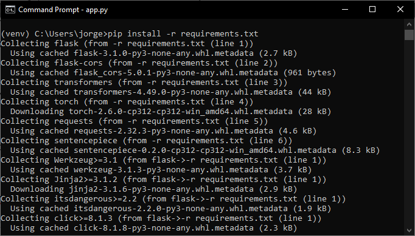

# Servicio Web de Traducción con Flask y Hugging Face

Este proyecto implementa un servicio web de traducción de texto de inglés a español utilizando Flask y un modelo preentrenado de Hugging Face. 
Además, incluye una interfaz web sencilla (HTML + JavaScript) que permite a los usuarios ingresar texto y recibir la traducción directamente desde su navegador.

## Tecnologías utilizadas
- **Flask**: Framework para el servicio web.
- **Hugging Face Transformers**: Para cargar el modelo de traducción.
- **Python 3.x**: Lenguaje de programación.
- **Postman / curl**: Para probar la API.
- **GitHub**: Para el control de versiones.

## Modelo Utilizado
Este servicio usa el modelo **Helsinki-NLP/opus-mt-en-es**, un modelo preentrenado de Hugging Face para la traducción de inglés a español.

## Estructura del Proyecto
```
huggingface-flask-translate/
│-- app.py  # Archivo principal con la API y la interfaz web
│-- requirements.txt  # Dependencias necesarias
│-- README.md  # Documentación del proyecto
```

## Código Principal
El servicio se basa en Flask y Hugging Face Transformers:
```python
from flask import Flask, request, jsonify
from flask_cors import CORS  # Habilitar CORS
from transformers import AutoModelForSeq2SeqLM, AutoTokenizer
from threading import Thread

# Crear la app de Flask
app = Flask(__name__)
CORS(app)  # Permitir peticiones desde cualquier origen

# Cargar el modelo de Hugging Face
model_name = "Helsinki-NLP/opus-mt-en-es"  # Modelo de traducción de inglés a español
model = AutoModelForSeq2SeqLM.from_pretrained(model_name)
tokenizer = AutoTokenizer.from_pretrained(model_name)

# Ruta para la traducción
@app.route("/translate", methods=["POST"])
def translate():
    data = request.json
    if "text" not in data:
        return jsonify({"error": "Falta el campo 'text'"}), 400

    input_text = data["text"]
    inputs = tokenizer(input_text, return_tensors="pt", truncation=True)
    outputs = model.generate(**inputs)
    translated_text = tokenizer.decode(outputs[0], skip_special_tokens=True)

    return jsonify({"translated_text": translated_text})

# Ejecutar la aplicación
if __name__ == "__main__":
    app.run(host="0.0.0.0", port=5555)
```

## Interfaz Web
El servicio incluye una interfaz HTML + JavaScript para realizar pruebas desde el navegador.
```html
<!DOCTYPE html>
<html lang="es">
<head>
    <meta charset="UTF-8">
    <meta name="viewport" content="width=device-width, initial-scale=1.0">
    <title>Servicio de Traducción</title>
    <script>
        async function sendTranslation() {
            const text = document.getElementById("inputText").value;
            const response = await fetch("http://localhost:5555/translate", {
                method: "POST",
                headers: {
                    "Content-Type": "application/json"
                },
                body: JSON.stringify({ text: text })
            });

            const data = await response.json();
            document.getElementById("translationResult").innerText = `Traducción: ${data.translated_text}`;
        }
    </script>
</head>
<body>
    <div style="max-width: 600px; margin: 0 auto; text-align: center;">
        <h1>Servicio de Traducción</h1>
        <textarea id="inputText" rows="4" cols="50" placeholder="Escribe un texto en inglés..."></textarea>
        <br><br>
        <button onclick="sendTranslation()">Traducir</button>
        <p id="translationResult" style="margin-top: 20px; font-size: 18px; font-weight: bold;"></p>
    </div>
</body>
</html>
```

## Instalación y Configuración
### 1. Clonar el repositorio
```bash
git clone https://github.com/jorgeluisjrl/huggingface-flask-translate.git
cd huggingface-flask-translate
```

### 2. Crear un entorno virtual (opcional pero recomendado)
```bash
python -m venv venv
source venv/bin/activate  # En Windows: venv\Scripts\activate
```

### 3. Instalar dependencias
```bash
pip install -r requirements.txt
```


## Ejecución del servicio
```bash
python app.py
```
El servicio estará disponible en `http://localhost:5555`

## Uso del servicio

### **1. Prueba con `curl`**
```bash
curl -X POST "http://localhost:5555/translate" -H "Content-Type: application/json" -d '{"text": "Hello, how are you?"}'
```

### **2. Prueba con Postman**
- Configura una petición `POST` a `http://localhost:5555/translate`
- Envía un JSON con la clave `text`
- Observa la respuesta con el texto traducido

### **3. Uso en Navegador**
Si la aplicación incluye una interfaz web, accede a `http://localhost:5555/` y realiza pruebas interactivas.

## Capturas de Pantalla
Incluir capturas de:
1. **Ejecución del servidor Flask** en la terminal.
2. **Prueba exitosa en Postman o `curl`**.
3. **Interfaz web en funcionamiento** (si aplica).

## Posibles Mejoras
- **Soporte para múltiples modelos** de traducción.
- **Implementación de autenticación** para mayor seguridad.
- **Despliegue en la nube** para acceso global.

## Autores
- **Jorge**

## Licencia
Este proyecto se distribuye bajo la licencia MIT.
